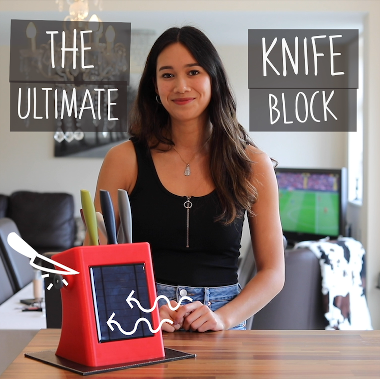
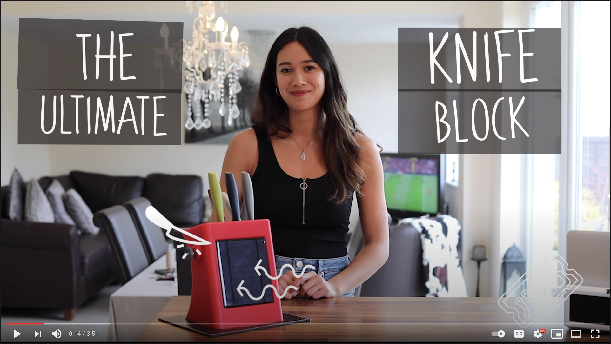
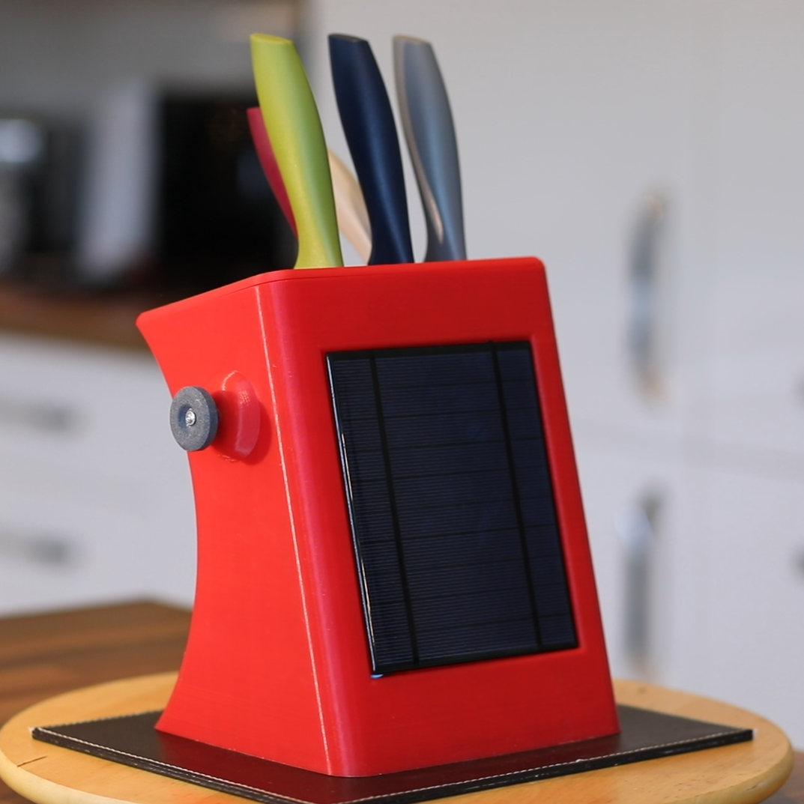

# [T3chFlicks](https://t3chflicks.org): The Ultimated Knife Block
> Create a 3D printed knife block with motorised knife shapener which is charged by a solar panel.

--- 

## `tutorials`

 

 ## 💡 Product Showcase
> 
* Full sized knife block with five slots
* Solar charging circuit
* Motorised knife shapener
  

---

This project was created by [T3chFlicks](https://t3chflicks.org) - A tech focused education and services company.

---